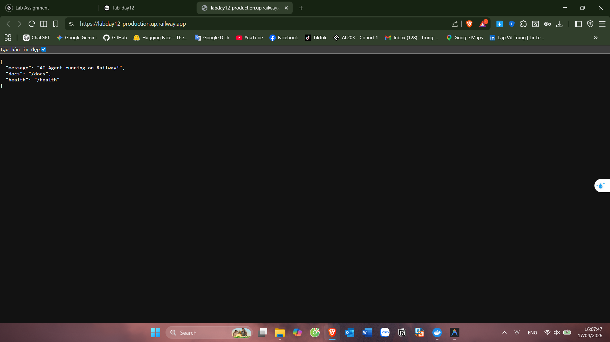
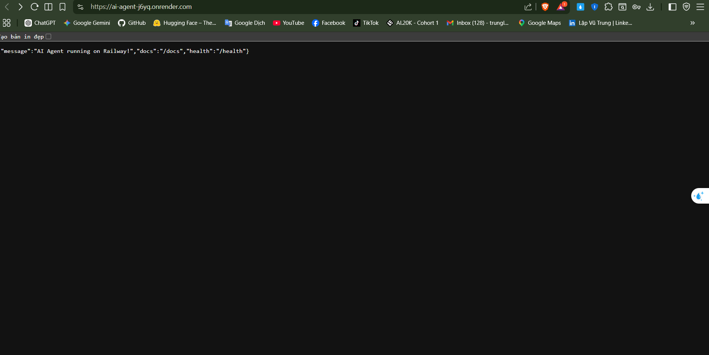
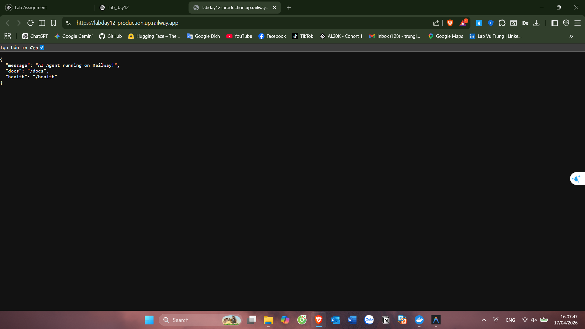

# Deployment Information

## Public URL

https://my-production-agent-production-aab1.up.railway.app

## Platform

Railway

## Test Commands

### Health Check

```bash
curl https://my-production-agent-production-aab1.up.railway.app/health
# Expected: {"status": "ok", "redis": true}
```

### API Test (with authentication)

```bash

curl -X POST https://my-production-agent-production-aab1.up.railway.app/chat \
  -H "X-API-Key: my-secret-key" \
  -H "Content-Type: application/json" \
  -d '{"question": "Hello from external client"}'
```

## Environment Variables Set

- `PORT`: 8000
- `REDIS_URL`: ${{Redis.REDIS_URL}}
- `AGENT_API_KEY`: my-secret-key
- `JWT_SECRET`: trung-lap-agent-2026-secret
- `OPENAI_API_KEY`: sk-proj-...
- `LOG_LEVEL`: INFO

## Screenshots

### Deployment dashboard



### Service running



### Test results


