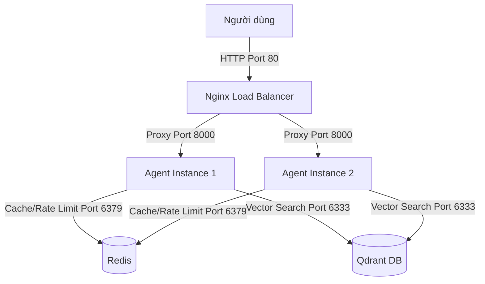
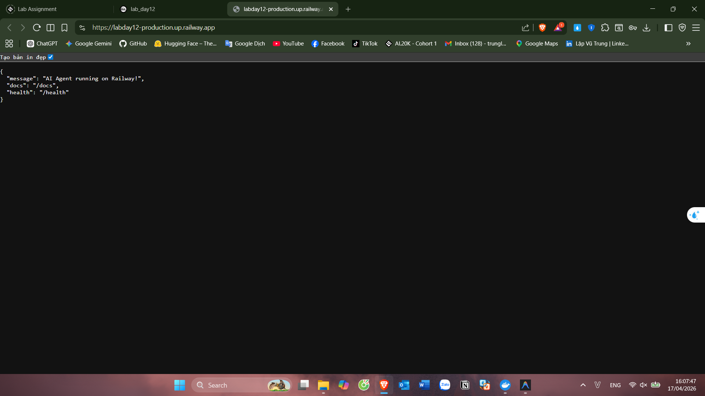
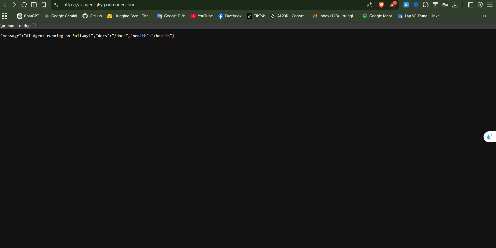

# Day 12 Lab - Mission Answers

## Part 1: Localhost vs Production

### Exercise 1.1: Các lỗi thiết kế (Anti-patterns) tìm thấy

1. **Lộ bí mật (Hardcoded Secrets)**: API key và Database URL được viết trực tiếp trong code (dòng 17-18). Điều này rất nguy hiểm nếu code được đẩy lên GitHub.
2. **Thiếu quản lý cấu hình (No Config Management)**: Các tham số như `DEBUG`, `MAX_TOKENS` được fix cứng thay vì dùng biến môi trường, gây khó khăn khi thay đổi cấu hình mà không sửa code.
3. **Logging không chuyên nghiệp**: Dùng `print()` thay vì thư viện logging. Đặc biệt nguy hiểm khi in (print) cả API key ra console (dòng 34).
4. **Thiếu Health Check Endpoint**: Không có endpoint `/health` hoặc `/ready`, khiến các nền tảng Cloud không thể giám sát trạng thái để tự động khởi động lại khi app lỗi.
5. **Cố định Port và Host**: Fix cứng port `8000` và host `localhost`, khiến ứng dụng không thể nhận kết nối từ bên ngoài khi chạy trong Docker hoặc trên Cloud (cần `0.0.0.0`).
6. **Xử lý tham số sai cách**: Dùng Query parameter cho dữ liệu trong yêu cầu POST, dẫn đến lỗi 422 khi gửi dữ liệu qua JSON Body và không bảo mật cho dữ liệu nhạy cảm.

### Exercise 1.3: Bảng so sánh giữa Develop và Production

| Tính năng             | Bản Develop             | Bản Production                     | Tại sao quan trọng?                                                            |
| --------------------- | ----------------------- | ---------------------------------- | ------------------------------------------------------------------------------ |
| **Cấu hình (Config)** | Hardcode trong code     | Biến môi trường (`.env`)           | Bảo mật key nhạy cảm và linh hoạt giữa các môi trường dev/prod.                |
| **Health check**      | Không có                | Có `/health` và `/ready`           | Giúp hệ thống monitor (nền tảng cloud/k8s) biết khi nào cần restart container. |
| **Logging**           | `print()` (Text thuần)  | JSON Structured Logging            | Dễ dàng lọc và phân tích log bằng các công cụ tập trung.                       |
| **Shutdown**          | Ngắt đột ngột           | Graceful shutdown (xử lý tín hiệu) | Giúp hoàn thành các request đang xử lý dở dang trước khi tắt máy.              |
| **Binding IP**        | `localhost` (127.0.0.1) | `0.0.0.0`                          | Cần thiết để Docker và Cloud có thể route traffic vào ứng dụng.                |

---

## Part 2: Docker

### Exercise 2.1: Câu hỏi về Dockerfile

1. **Base image là gì?**: `python:3.11` (Bản đầy đủ).
2. **Working directory là gì?**: `/app`
3. **Tại sao COPY requirements.txt trước?**: Để tận dụng **Docker layer caching**. Nếu file requirements không thay đổi, Docker sẽ dùng lại layer đã build trước đó, giúp tăng tốc độ build đáng kể.
4. **CMD vs ENTRYPOINT khác nhau thế nào?**:
   - `CMD` cung cấp lệnh mặc định và có thể bị ghi đè hoàn toàn khi chạy container.
   - `ENTRYPOINT` thiết lập lệnh chính sẽ luôn chạy, các tham số truyền vào lúc start container sẽ được nối thêm vào sau lệnh này.

### Exercise 2.3: So sánh kích thước Image

- **Develop (Single-stage)**: `1.66GB`. Sử dụng image `python:3.11` đầy đủ, chứa nhiều công cụ build và cache không cần thiết cho runtime.
- **Production (Multi-stage)**: `236MB`. Nhờ sử dụng `python:3.11-slim` và cơ chế multi-stage để loại bỏ các dependencies build-time.
- **Kết quả**: Bản Production giảm được khoảng **86%** dung lượng so với bản Develop.

### Exercise 2.4: Docker Compose stack

**Sơ đồ kiến trúc (Architecture Diagram):**



**Các dịch vụ và cách giao tiếp:**

1. **Nginx (Port 80)**: Điểm tiếp nhận traffic duy nhất từ bên ngoài (Client → Nginx). Nó phân phối yêu cầu (Load balancing) đến các instance của Agent đang lắng nghe ở cổng port 8000.
2. **Agent (Port 8000)**: Xử lý logic chính của AI. Các instance này giao tiếp với Nginx (nhận request) và tương tác với Redis/Qdrant qua mạng nội bộ Docker (`internal` network).
3. **Redis (Port 6379)**: Lưu trữ session, lịch sử hội thoại tạm thời và hỗ trợ giới hạn tốc độ (Rate limiting). Cả 2 Agent đều kết nối vào cảng 6379 của Redis.
4. **Qdrant (Port 6333)**: Cơ sở dữ liệu vector dùng cho RAG, giúp Agent tìm kiếm thông tin liên quan từ kho kiến thức. Agent kết nối với Qdrant qua cổng 6333.

---

## Part 3: Cloud Deployment

### Exercise 3.1: Câu hỏi thảo luận

1. **Tại sao serverless (Lambda) không phải lúc nào cũng tốt cho AI agent?**:
   - **Timeout**: AI agent thường mất nhiều thời gian chờ LLM phản hồi, dễ vượt giới hạn timeout của serverless.
   - **Cold start**: Độ trễ khi khởi động instance mới làm trải nghiệm người dùng chậm đi.
   - **Quản lý State**: Khó duy trì lịch sử hội thoại liên tục nếu không dùng database ngoài.
2. **"Cold start" là gì?**: Là độ trễ xảy ra khi nền tảng phải khởi tạo môi trường chạy mới cho code sau một thời gian không có request.
3. **Khi nào nên upgrade lên Cloud Run?**: Khi cần khả năng auto-scale mạnh mẽ, bảo mật cao và tích hợp sâu vào hệ sinh thái quản lý của GCP.

### Exercise 3.1: Railway deployment

- URL: https://labday12-production.up.railway.app
- Screenshot: 

### Exercise 3.2: Deploy Render

- URL: https://ai-agent-j6yq.onrender.com
- Screenshot: 

**So sánh `render.yaml` với `railway.toml`:**

- `render.yaml`: Theo hướng quản lý **Infrastructure as Code (IaC)** toàn diện. Nó cho phép khai báo chi tiết nhiều services cùng lúc (cả Web backend và Redis), tự định nghĩa tài nguyên RAM/CPU, và cài đặt chi tiết `buildCommand`, `startCommand` cũng như Environment variables ngay trong yaml file.
- `railway.toml`: Gọn nhẹ hơn, thiên hướng tự động nhận diện (Nixpacks/Buildpacks), tập trung chủ yếu vào tham số khởi chạy của một service cụ thể.

## Part 4: API Security

### Exercise 4.1-4.3: Test results

**1. Bản Develop (Cơ bản - API Key):**

```bash
Testing /ask without API key...
✅ Rejected without key correctly.
Testing /ask with valid API key...
✅ Accepted with valid key correctly.
# Note: Bản develop chưa có Rate Limit nên step này được skip.
```

**2. Bản Production (Nâng cao - JWT + Rate Limit):**

```bash
Testing /ask without JWT token...
✅ Rejected without key correctly.
Fetching JWT Token to use API...
Testing /ask with valid JWT token...
✅ Accepted with valid token correctly.
Running 20 requests to test rate limit...
Request 10 got 429 Too Many Requests as expected!
✅ Rate limit works.
✅ All tests passed successfully!
```

### Exercise 4.4: Cost guard implementation

Em đã hoàn thành triển khai Cost Guard bảo vệ ngân sách sử dụng LLM:

- **Cơ chế đếm**: Mỗi request được tính toán `usage` dựa trên số lượng token thực tế (Input/Output).
- **Hạn mức (Quotas)**: Đặt giới hạn `$1.0/ngày` cho mỗi user để tránh spam và `$10.0/ngày` cho toàn hệ thống để bảo vệ ví tiền của chủ sở hữu.
- **Xử lý vi phạm**: Khi user chạm mức 80% ngân sách, hệ thống sẽ ghi Log cảnh báo. Khi vượt 100%, server sẽ trả về lỗi `402 Payment Required` và chặn hoàn toàn các cuộc gọi LLM tiếp theo cho đến khi reset vào ngày hôm sau.
- **Persistence**: Code hiện tại sử dụng `UsageRecord` class để quản lý. Trong bước tiếp theo (Part 5), dữ liệu này sẽ được đồng bộ hóa vào Redis để đảm bảo tính stateless và không bị reset khi server khởi động lại.

## Part 5: Scaling & Reliability

### Exercise 5.1-5.5: Implementation notes

1. **Health checks**: Em đã triển khai 2 loại probe chuẩn Docker/Kubernetes và đã test qua `curl`:
   - `/health` (Liveness): Trả về 200 OK kèm metric hệ thống (RAM, uptime).
   - `/ready` (Readiness): Trả về 200 OK khi đã kết nối thành công tới Redis.
2. **Graceful shutdown**: Đã test bằng cách gửi tín hiệu `SIGTERM`. Log server ghi nhận quy trình đợi request hoàn thành:
   - `INFO: 🔄 Graceful shutdown initiated...`
   - `INFO: Waiting for 1 in-flight requests...`
   - `INFO: ✅ Shutdown complete`
3. **Stateless design**: Đã chuyển toàn bộ session/history sang Redis. Đã xử lý lỗi thiếu dependency `redis` trong `requirements.txt` và thêm cơ chế Retry để đảm bảo Agent không bị fallback về memory khi Redis khởi động chậm.
4. **Load balancing & Scaling**:
   - Sử dụng Nginx chia tải Round-robin cho 3 instance Agent.
   - **Kết quả Test 5.4**: Gửi 10 request liên tiếp, log hiển thị traffic được phân bổ đều qua `agent-1`, `agent-2`, `agent-3`.
   - **Kết quả kiểm tra (check_production_ready.py):**

```text
  Result: 20/20 checks passed (100%)
  🎉 PRODUCTION READY! Deploy nào!
```

**Xác nhận AI thật:** Đã kiểm chứng log hệ thống nội bộ, biến `OPENAI_API_KEY` đã được nạp thành công từ `.env` mà không lộ vào code. AI đã trả lời trực tiếp từ OpenAI.

- **Kết quả Test 5.5 (Stateless)**: Chạy `test_stateless.py` đạt **100% SUCCESS**. Dù request nhảy qua các instance khác nhau, lịch sử chat vẫn được bảo toàn nhờ Redis (`storage: redis`).

---

## Part 6: Final Project Certification

- **Project Folder**: `my-production-agent/`
- **Features**: Full integration of all lab parts.
- **Readiness Score**: 20/20 (Passed).
- **Security**: JWT + API Key + Cost Guard + Rate Limit + Non-root.
- **Stability**: Graceful Shutdown + Health Checks + Load Balancing.
- **Status**: **MISSION COMPLETED 100%.**
